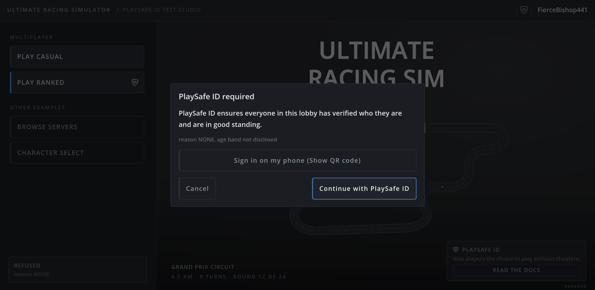
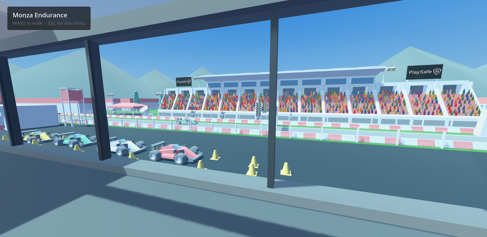
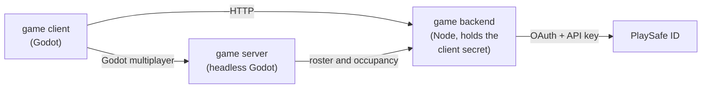

# Ultimate Racing Simulator

  

  

---
A reference integration of Sign in with PlaySafe ID into a game that has a
developer-run backend and its own authoritative game server, and no web portal
anywhere.

> [!IMPORTANT]
> This repository was created with AI-assistance from human-created technical
> specifications and designs and many rounds of review and testing. Please use
> this repo as an illustrative and hands-on example of integration rather than
> an instruction manual on exactly how you should execute your integration.

It is a working game rather than a snippet, so it can be played and watched deciding
against a real account.

  

The player accounts and session tokens in
[`backend/session.ts`](backend/session.ts) are a stand-in for the ones your
game already has, and are not an example of how to build authentication. That
file still appears in three of the nine steps below, because keeping `state`
server side and storing the PSID have to happen somewhere: be informed by
what those steps do, not the way this file holds a session.

## Key Integration Milestones

Nine steps, each linking to the code that does it.

| #   | Do this                                                                            | Code                                                              |
| --- | ---------------------------------------------------------------------------------- | ----------------------------------------------------------------- |
| 1   | Register an OAuth client with your callback URL, and get an API key carrying `READ` | [Partner Portal](https://docs.playsafeid.com/docs/partner-portal) |
| 2   | Read the authorisation server's metadata once, as plain OAuth 2 and not OIDC        | [`oauthClient`](backend/playsafe.ts#L98)                          |
| 3   | Send the player to an authorisation URL carrying PKCE, `state` and `audience`       | [`startSignIn`](backend/playsafe.ts#L120)                         |
| 4   | Keep `state` and the PKCE verifier server side, keyed by the player who started it  | [`putSignIn`](backend/session.ts#L204)                            |
| 5   | On the callback, find the player from `state` alone, and spend it exactly once      | [`takeSignIn`](backend/session.ts#L226)                           |
| 6   | Redeem the code, then spend the **access** token on `GET /oauth/userinfo`           | [`completeSignIn`](backend/playsafe.ts#L157)                      |
| 7   | Store the PSID. Throw the standing and the age band away                           | [`attachPsid`](backend/session.ts#L161)                           |
| 8   | On every gated action, read the standing live, with your API key                    | [`lookupStatus`](backend/playsafe.ts#L235)                        |
| 9   | Decide who gets in. This step is yours, and PlaySafe ID has no opinion on it        | [`decide`](backend/admission.ts#L49)                              |

Steps 2, 3, 6 and 8 are every call this backend makes to PlaySafe ID.

One backend file sits on no row above. [`scan.ts`](backend/scan.ts) draws a QR code
so a sign-in started on a monitor can finish on a phone. It adds no step and changes
no call: `state` already says which player a callback belongs to, so whichever
device completes the flow, the PSID lands on the same session. That
convenience is also the flow's one sharp edge, and it belongs to the OAuth
standard rather than to PlaySafe ID.

## Three tiers

| Tier         | Holds                                        | Never holds                                                     |
| ------------ | -------------------------------------------- | --------------------------------------------------------------- |
| Game backend | The client secret, the API key, the PSIDs    | Any game logic. It answers one question and hands out tickets   |
| Game server  | A roster of tickets, names and kick times    | A PSID. It never asks whether somebody may play                 |
| Game client  | A session token, and whether a PSID is held  | A client id, a client secret, an authorisation code, a standing |

A standing appears in exactly one response, `POST /play`
([`play`](backend/server.ts#L255)). No other route returns one, so the client has no
standing to cache and gate on.

The client never greys out or disables a button on the basis of a status. A cached
status is stale the moment it is written, so a disabled button is wrong in the
direction that matters: it shows a ban that has been lifted, or admits one that has
just landed. Admission is decided by the backend on the click, every time. Clicking a
gated action is also how a player finds out what PlaySafe ID is.

## Things this deliberately does not do

- **It does not matchmake.** The worlds are standing servers with a capacity, so
  entry asks only whether this player may enter and whether there is room. A
  player admitted to an empty world joins it immediately, and `capacity` is a
  ceiling, never a target.
- **A refusal never steers the player to a different lobby.** Where a PlaySafe
  ID check is what failed, the modal explains it and offers one Close.
  Offering the open lobby reads as a consolation prize, and a player who chose
  the protected door chose it.
- **There is no login screen, and no chat.** PlaySafe ID is asked for at the
  moment a gated action is attempted.
- **There is no production-grade authentication for the game itself.** Usually
  a platform SDK would support logging into your own backend. This is skipped
  in this example.

---

  

